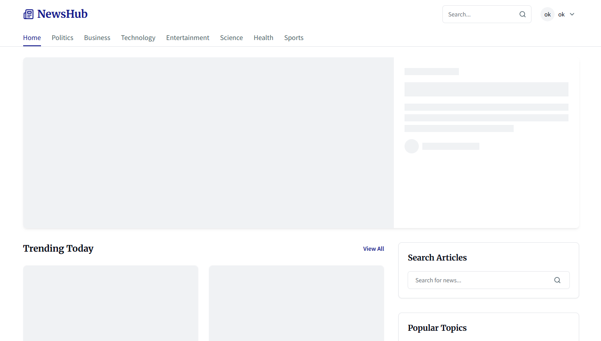
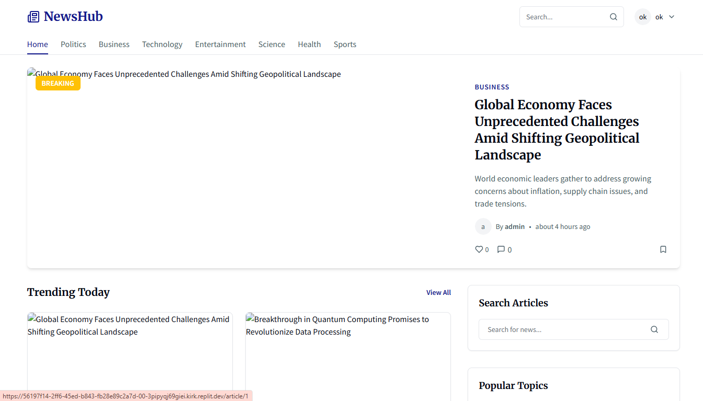

# 📰 NewsStreamHub

Platform berita modern real-time berbasis React, Node.js, Express, dan SQLite.

---

## 🚀 Tentang Project

**NewsStreamHub** adalah aplikasi web berita yang menampilkan artikel dari berbagai kategori secara real-time. Dibangun dengan:
- **Frontend:** React 18 + Vite + Tailwind CSS
- **Backend:** Node.js, Express.js
- **Database:** SQLite (dengan Drizzle ORM)
- **ORM:** Drizzle ORM
- **UI/UX:** Modern, responsif, dan animatif

---

## 📁 Struktur Proyek

```
NewsStreamHub/
├── client/         # Frontend React
│   ├── public/
│   └── src/
│       ├── components/
│       ├── hooks/
│       ├── lib/
│       ├── pages/
│       └── types/
├── server/         # Backend Express.js
│   ├── db.ts
│   ├── routes.ts
│   ├── seed-db.ts
│   └── ...
├── shared/         # Schema & shared types
├── assets/         # Gambar demo, video, dsb
├── drizzle.config.ts/json
├── README.md
└── package.json
```

---

## ⚙️ Cara Menjalankan Aplikasi

1. **Clone repository**
   ```bash
   git clone https://github.com/Fairus-24/NewsStreamHub.git
   cd NewsStreamHub
   ```

2. **Install semua dependensi**
   ```bash
   npm install
   npm run db:push
   npm run seed
   npm run dev
   ```
   > Semua perintah di atas dijalankan dari root folder (bukan di client/server terpisah).

3. **Akses aplikasi**
   - Frontend: [http://localhost:3000](http://localhost:3000)
   - Backend API: [http://localhost:5000](http://localhost:5000)

---

## 🔄 Proxy API (Agar React bisa akses backend)

Pastikan di `client/package.json` ada:
```json
"proxy": "http://localhost:5000"
```

---

## 🧪 Contoh Endpoint API

- `GET /api/articles` — Daftar artikel
- `GET /api/articles/:id` — Detail artikel
- `POST /api/articles/:id/like` — Like/unlike artikel
- `POST /api/articles/:id/bookmark` — Bookmark/unbookmark artikel
- ...dan endpoint lain sesuai kebutuhan

---

## 📸 Demo & Tampilan

**Homepage**


**Detail Berita**


**Video Demo**
[Demo Video (Google Drive)](https://drive.google.com/file/d/1ogk7dbrKd7RasTKFXsVER20lBFUGblnL/view?usp=sharing)

---

## 🙌 Kontribusi

Kontribusi terbuka! Silakan fork, buat branch, dan pull request.

---

## 📄 Lisensi

MIT License. Lihat file `LICENSE` untuk detail.

---

## 📫 Kontak

Fairus – [GitHub @Fairus-24](https://github.com/Fairus-24)

---

## 🔧 Catatan
- Jika ada perubahan port, endpoint, atau struktur folder, sesuaikan instruksi di atas.
- Untuk tampilan lebih hidup, bisa tambahkan GIF demo, badge CI/CD, atau link deploy jika sudah di-hosting.
